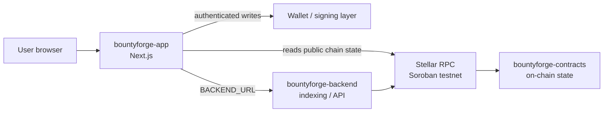

# BountyForge

**Open bounties with escrow, review, and payout workflows for Stellar anchors.**

> **Status: v0.1.0 development baseline — not audited, not production-ready.**

BountyForge is a three-repository system for Stellar anchors that need deterministic bounty escrow and payout with on-chain state as the source of truth. Off-chain services stay out of consensus-critical logic.

## The three repositories

| Repository | Role | Documentation here |
| --- | --- | --- |
| [bountyforge-contracts](https://github.com/stellar-bountyforge/bountyforge-contracts) | On-chain Soroban state and authorization | [Smart Contract](contract.md) |
| **bountyforge-app** (this repo) | User-facing web application | [User Guide](user-guide.md) |
| [bountyforge-backend](https://github.com/stellar-bountyforge/bountyforge-backend) | Off-chain indexing/API and operational services | [Backend API](api.md) |

## Key features (current baseline)

- **Next.js web app** (App Router) with a Stellar testnet network-summary view.
- **Soroban contract** with admin initialization, auth-gated writes, and value storage (`initialize` / `record` / `read`).
- **Minimal backend** HTTP service with `/health` and `/network` endpoints.
- TypeScript across the app and backend; Rust (`no_std`) for the contract.

## Architecture at a glance

## Where to start

- New contributor? → [Getting Started](getting-started.md)
- Want to run the app? → [User Guide](user-guide.md)
- Calling the backend? → [Backend API](api.md)
- Building the contract? → [Smart Contract Guide](contract.md)

## Important resources

- Source code: [github.com/stellar-bountyforge](https://github.com/stellar-bountyforge)
- Maintainer: **Hikmaholadele** ([@Hikmaholadele](https://github.com/Hikmaholadele))
- License: [Apache-2.0](https://github.com/stellar-bountyforge/bountyforge-app/blob/main/LICENSE)
- Security policy: [SECURITY.md](https://github.com/stellar-bountyforge/bountyforge-app/blob/main/SECURITY.md)
